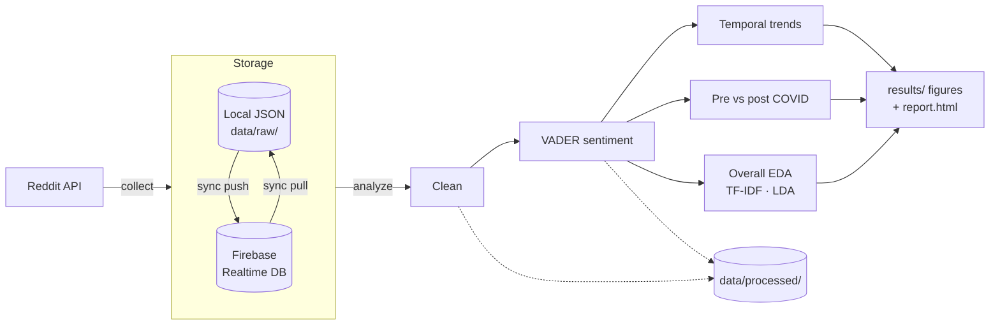

# From "Mom Groups" to Medical Triage: Pre-eclampsia Discourse on Reddit

[](https://github.com/prats3992/preeclampsia-reddit/actions/workflows/ci.yml)

Code, figures and paper for a computational social science study of how people discuss
**pre-eclampsia** on Reddit between 2013 and 2025. The project uses sentiment analysis, temporal
trends, a pre- vs post-COVID-19 comparison, TF-IDF and LDA topic modelling.

*Ananya Singla, Pratham Arora. Computational Social Science, Plaksha University.*
The paper is in [`paper/final_report.pdf`](paper/final_report.pdf) and the slides are in
[`docs/presentation.pdf`](docs/presentation.pdf).

## Pipeline



1. **Collect**: PRAW pulls posts from about 20 pregnancy and health subreddits. Each subreddit
   has a relevance weight, set in [`config.py`](src/preeclampsia_reddit/config.py).
   Dedicated subreddits are collected in full. In broader subreddits, a post is kept only if
   it mentions a core pre-eclampsia term. Posts and comments get a relevance score built from
   keyword lists that three LLMs suggested independently (raw answers in
   [`docs/llm_suggestions/`](docs/llm_suggestions)).
2. **Clean**: drops duplicates, expands contractions, converts emoji to text, strips
   URLs/markup and tags each record with UTC timestamps and its COVID period
   (Post-COVID means on or after 2020-03-01).
3. **Score**: VADER compound sentiment. ≥ 0.05 is positive and ≤ −0.05 is negative.
4. **Analyse** (`results/`):
   - `temporal/`: yearly sentiment trend, volume by sentiment, % positive, YoY change and
     yearly word clouds.
   - `covid_comparison/`: sentiment distributions and t-test, volume, subreddit share and
     word clouds.
   - `overall/`: posts vs comments sentiment, per-subreddit sentiment, TF-IDF, 5-topic LDA
     and medical-term frequency.
   - `report.html`: one page with every figure and the key numbers.

## Setup

Requires Python ≥ 3.10.

```bash
python -m venv .venv && source .venv/bin/activate
pip install -e ".[all]"          # or ".[collect]" / ".[firebase]" / plain "." for analysis only
cp .env.example .env             # then fill in what you need (see below)
```

### Environment variables

| Variable | Needed for | Default |
|---|---|---|
| `STORAGE_BACKEND` | choose `local` or `firebase` storage | `local` |
| `DATA_DIR` / `RESULTS_DIR` | where data and outputs are written | `data` / `results` |
| `FIREBASE_CREDENTIALS` | `sync`, or `--backend firebase`: path to service-account JSON | — |
| `FIREBASE_DATABASE_URL` | `sync`, or `--backend firebase` | — |
| `REDDIT_CLIENT_ID`, `REDDIT_CLIENT_SECRET` | `collect` | — |
| `REDDIT_USER_AGENT` | `collect` | `preeclampsia-reddit-research/1.0` |

Analysing data that is already stored locally needs no credentials.

## Usage

```bash
preeclampsia-reddit sync pull        # one-off: download the Firebase dataset into data/raw/
preeclampsia-reddit analyze          # clean, score, regenerate every figure + results/report.html
preeclampsia-reddit stats            # counts per subreddit in the active backend

preeclampsia-reddit collect                          # collect new data (uses STORAGE_BACKEND)
preeclampsia-reddit collect --subreddits preeclampsia --no-comments
preeclampsia-reddit analyze --backend firebase       # analyse straight from Firebase
preeclampsia-reddit sync push                        # upload local data to Firebase
```

`python -m preeclampsia_reddit …` also works. To rebuild the paper with fresh figures, run
`cd paper && pdflatex final_report.tex`.

## Repository layout

```
src/preeclampsia_reddit/
  config.py            study parameters: subreddit weights, keywords, limits, COVID date
  settings.py          environment-driven runtime settings
  storage/             Storage interface, LocalStorage (JSON), FirebaseStorage
  collection/          PRAW collector and keyword relevance scoring
  cleaning.py          text cleaning, timestamps, COVID period
  sentiment.py         VADER scoring
  analysis/            temporal, covid, overall analyses and shared plotting style
  report.py            HTML report
  pipeline.py, cli.py  orchestration and command-line entry point
tests/                 unit tests and an end-to-end pipeline test on synthetic data
results/               figures used in the paper
paper/                 LaTeX source and compiled PDF
docs/                  slides and the raw LLM keyword/subreddit suggestions
```

## Development

```bash
pytest          # about 1 minute, no network or credentials needed
ruff check .
```

## Data and ethics

The collected Reddit data is **not** distributed with this repository. `data/` is git-ignored.
The posts are personal health narratives, so share only aggregate results, and follow
[Reddit's Data API Terms](https://redditinc.com/policies/data-api-terms) if you collect your
own data. The analysis never uses usernames.

## License

[MIT](LICENSE)
